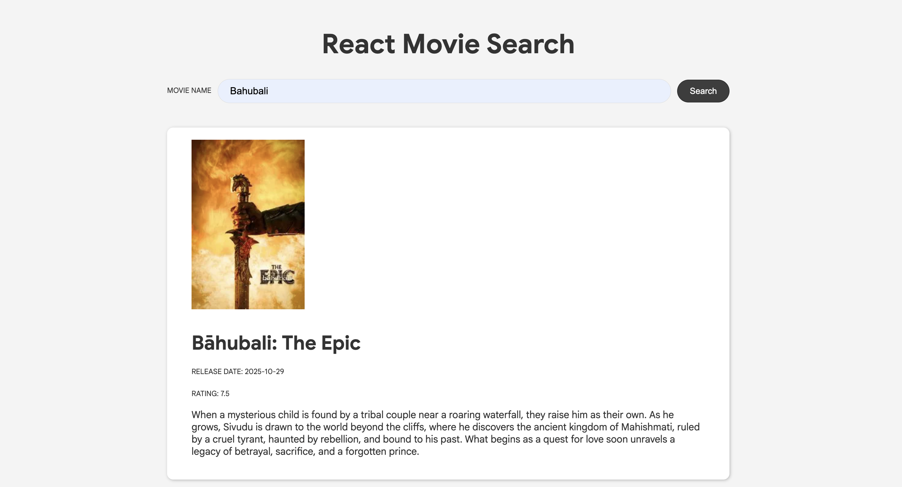

## React Movie Search App
A simple Movie Search App built with **React** and [The Movie DB](https://www.themoviedb.org/) **API**.

You Search for any movie and get detailed information featuring ratings, release dates, plot summaries and a clean, responsive interface.

This project was created to practice API integration, state management, and component architecture in React.

[ Let's Try in Live :)](https://gmarav05.github.io/react-movie-search-app/)

## Video


https://github.com/user-attachments/assets/5c795bae-e937-4e9b-8e09-7276fac0cf1b


## Image



## Features

- **Real-time Search**: Search movies instantly from the OMDB database.

- **Detailed Movie Cards**:  Displays posters, ratings, release year, and plot summaries.

- **Responsive Design**: Seamless experience across desktop, tablet, and mobile devices.

- **Clean UI**: Modern, minimalist interface with intuitive navigation.

- **Error Handling**: Graceful handling of API errors and edge cases.

- **Fast Performance**: Optimized rendering with React best practices.

- **Built with Modern Tools**: Built using **React 19** and **Vite** for fast development and builds.

## Learnings

- API Integration: Fetching and handling data from external REST APIs.

- Practiced Async Operations and Handling asynchronous data fetching and loading states.

- Built reusable component architecture.

- Responsive Design: Creating mobile-first, adaptive layouts.

- Learned Vite configuration for GitHub Pages deployment.

## Live demo

[ View Live  :)](https://gmarav05.github.io/react-movie-search-app/)


## Technology Stack

**Frontend**: React 19.

 **API**: OMDB API.

**Build Tool**: Vite.

**Styling**: CSS3.

**Deployment**: GitHub Pages.


## Project Structure

```
react-movie-search-app/
├── node_modules/              # Dependencies
├── public/                    # Static assets
├── src/
│   ├── App.jsx                # Main app component
│   ├── Movie.jsx              # Movie card component
│   ├── SearchMovie.jsx        # Search functionality component
│   ├── index.css              # Global styles
│   └── main.jsx               # Entry point
├── .gitignore                 # Git ignore rules
├── eslint.config.js           # ESLint configuration
├── index.html                 # HTML template
├── package.json               # Project metadata & dependencies
├── package-lock.json          # Locked dependency versions
├── README.md                  # Project documentation
└── vite.config.js             # Vite configuration

```

## Getting Started

### Prerequisites

- Node.js (v16 or higher)
- npm or yarn package manager

## Installation

### Clone the repository
   ```bash
   git clone https://github.com/gmarav05/react-movie-search-app.git
   cd react-movie-search-app
   ```

### Install dependencies

```sh
npm install
```

### Run locally

```sh
npm run dev
```

### Build for production

```sh
npm run build
```

### Deploy to GitHub Pages

```sh
npm run deploy
```
---

 
